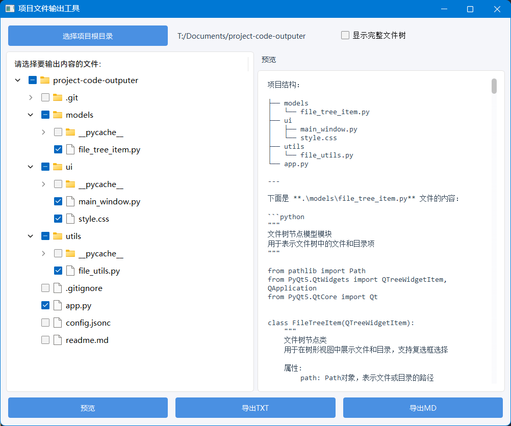

<!--  -->

# Project Code Outputer 项目代码输出工具

一个使用 PyQt5 编写的简单程序，能够快速地输出一个项目的目录结构和具体的代码到一个文件中，方便发送给 LLM 以快速了解项目。

# 用法

1. 安装依赖项(`pip install -r requirements.txt`)；
2. 运行`app.py`文件;

# 配置文件

- `config.json`:配置文件，包含以下内容:
  - `extension_mapping`:扩展名映射，用于将扩展名映射到 markdown 的代码框的语言标识符。
  - `black_list`: 文件树输出黑名单，控制完整输出文件树时，不显示在文件树的文件。
- `ui/style.css`:CSS 样式文件，用于设置界面样式。
